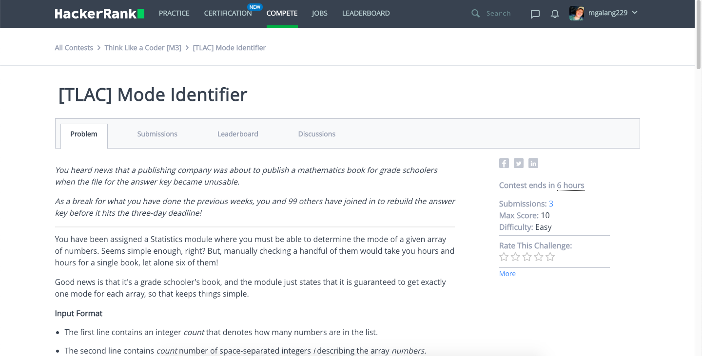
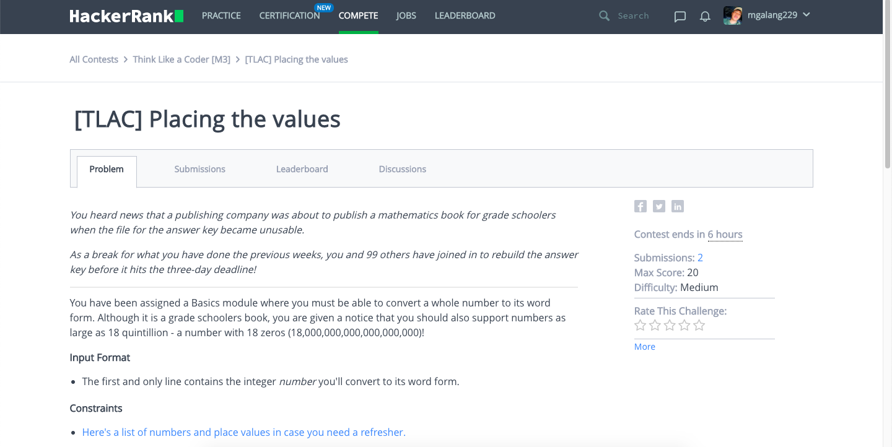
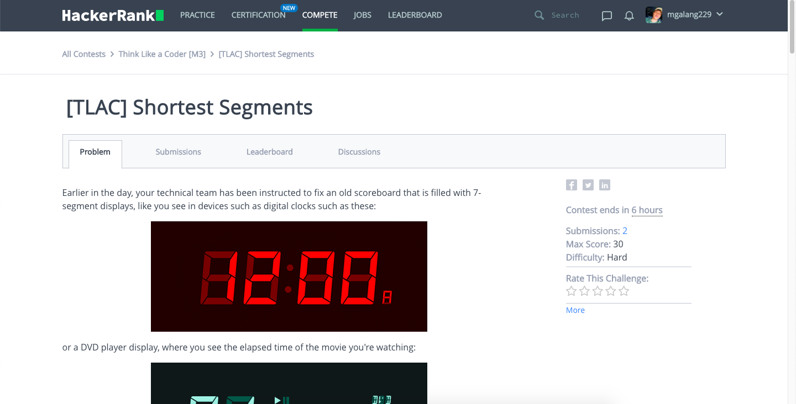

# Think-Like-a-Coder-Mark-3
# Problems
## Easy (My Score - 10 points out of 10)
### Mode Identifier

## Medium (My Score - 20 points out of 20)
### Placing the values

## Hard (My Score - 30 points out of 30)
### Shortest Segments

<pre>
  so in summary, na - perfect ko lahat WHAHAHAHAHAHA
</pre>
